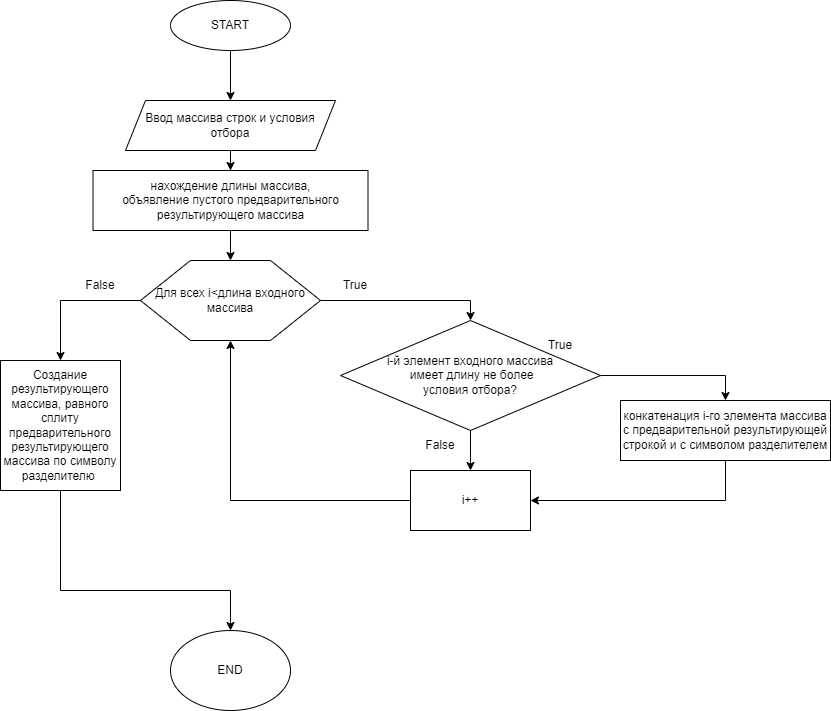

# Итоговая проверочная работа
## Постановка задачи
Написать программу, которая из имеющегося массива строк формирует массив из строк, длина которых меньше либо равна 3 символа. Первоначальный массив можно ввести с клавиатуры, либо задать на старте выполнения алгоритма. При решении не рекомендуется пользоваться коллекциями, лучше обойтись исключительно массивами.

## Решение

Для выполнения задачи сформирован алгоритм изображенный на рисунке ниже.



### Получение входных данных

Исходя из условия задачи способом получения входных данных выбран ввод с клавиатуры введя метод `string[] TypeAndSplitText()`.
```
string[] TypeAndSplitText()
{
Console.WriteLine("Введите строки через пробел: ");
string inputText = Console.ReadLine();
return inputText.Split(' ');
}
```

В приглашении к вводу данных обозначим символ-разделитель, которым будем отделять строки в массиве.
```
Console.WriteLine("Введите строки через пробел: ");
string inputText = Console.ReadLine();
```

Далее для работы алгоритма входная строка преобразуется методом `String.Split` в массив строк с символом-разделителем _пробелом_.
```
string[] stringArray = inputText.Split(' ');
```
Условие отбора также запрашивается у пользователя и проверяется на положительность.
```
int TypeLimit()
{
Console.WriteLine("Введите условие отбора по длине (должно быть > 0): ");
int limit = Convert.ToInt32(Console.ReadLine());
if (limit<0) limit = TypeLimit();
return limit;
}
```

### Описание реализации

Реализован метод принимающий на вход массив строк и возвращающий массив строк удовлетворяющий условию отбора по длине.

```
string[] GetLimitedStrings(string[] inputArray, int limit)
```
Для реализации метода определяется длина входного массива и определяется новая пустая строка, которая послужит буфером для удовлетворяющих элементов массива.

```
    int arrayLen = inputArray.Length;
    string preResultArray = String.Empty;
```
Поиск удовлетворяющих элементов массива осуществлен посредством оператора итерации for. В каждую итерацию включен анализ соответствия длины элемента входного массива условию отбора по длине.
>При выполнении условия производится конкатенация буфера удовлетворяющих элементов массива, символа разделителя _пробел_ и элемента входного массива текущей итерации.
```
for (int i = 0; i < arrayLen; i++)
    {
        if (inputArray[i].Length <= limit) preResultArray = preResultArray + ' ' + inputArray[i];
    }
```
Для преобразования буфера удовлетворяющих элементов массива в массив строк вновь используется метод `String.Split` по символу разделителю _пробел_.
>В связи с тем, что первое удовлетворяющее значение массива конкатенируется с пустой строкой преобразование осуществляется с опцией удаления пустой строки `StringSplitOptions.RemoveEmptyEntries`.
```
string[] resultArray = preResultArray.Split(' ', StringSplitOptions.RemoveEmptyEntries);
```
### Пример 

Вызов методов и вызов результата:
```
string[] inputArray = TypeAndSplitText();
int limit = TypeLimit();
string[] limitedStrings = GetLimitedStrings(inputArray, limit);

Console.WriteLine($"В введенном вами массиве строк присутствуют следующие строки с количеством символов не более {limit} [{String.Join(",", limitedStrings)}]");
```
Результат:
```
Введите строки через пробел: 
123 4444 22 1 555555 55555 5555
Введите условие отбора по длине (должно быть > 0): 
-2
Введите условие отбора по длине (должно быть > 0): 
3
В введенном вами массиве строк присутствуют следующие строки с количеством символов не более 3 [123,22,1]
```